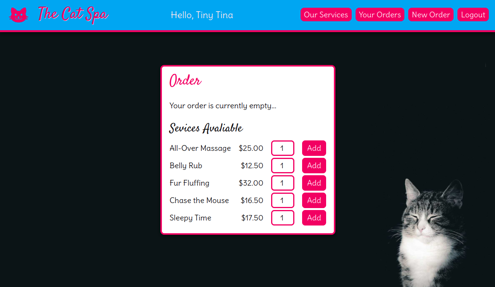

# Demo Project - Ordering System User Accounts

Demonstrates: 

- Creation of user accounts (with hashed & salted passwords)
- Logging in / out
- Admin level users
- Use of session data
- Adaption of UI based on login status
- Cart-based ordering system
- CRUD functionality:
   - Creation of new orders
   - Reading of existing order info
   - Updating of orders (e.g. marked as complete)
   - Deletion of orders
- Relational DB queries
   - Queries from individual tables
   - Queries with JOINs from both
   - Linking tables to manage many-to-many relationships

Site has a simple but responsive UI, including:
- mobile-first design
- various overviews for normal / admin users

## Screenshots

Home page

Home page on mobile

Mobile menu

Product List

Create New Account

Login

Create New Order

Order In Progress

View Own Orders

### Admin Views

View All Orders

Order Details

View All Users

User Details

